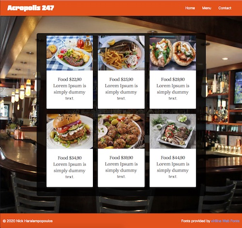
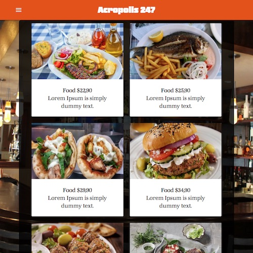
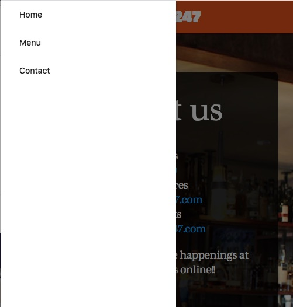

# Restaurant Page

This is a project of the JavaScript curriculum at Microverse - @microverseinc.
In this project, we have to create a restaurant page. The objective is to dynamically render every page using Javascript DOM manipulation.

## Description
- This is a page with a fixed menu bar and a footer. 
- There are 3 menu choices: Home which is the default, Menu, and Contact.
- Each menu choice renders part of the page and inserts it into the DOM tree.
- The page is fully responsive.
- In small sizes, the menu is replaced by a burger that opens a sidenav with the same choices.

## Screenshots

### Big Screen on menu


### Medium Screen


### Small Screen with sidenav open


## Built With

- HTML
  - HTML5 semantic elements
- CSS3
  - Materialize front-end framework 
- Dev Tools
  - npm
  - Webpack
- Linter
  - Eslint
- Javascript
- DOM Manipulation
- DocumentFragment
- Events

## Live Demo

[Live Demo Link](https://macnick.github.io/Restaurant-Page/)

## Dependencies

- css-loader: ^3.4.2,
- eslint: ^6.8.0,
- eslint-config-airbnb-base: ^14.1.0,
- eslint-plugin-import: ^2.20.1,
- file-loader: ^6.0.0,
- materialize-css: ^1.0.0-rc.2,
- script-loader: ^0.7.2,
- style-loader: ^1.1.3,
- webpack: ^4.42.0,
- webpack-cli: ^3.3.11

## Getting Started

To get a local copy up and running follow these simple steps.

1. Clone the project 
``` git clone https://github.com/macnick/Restaurant-Page.git ```
2. Install dependencies ``` npm install ```
3. Run script (Production Mode) ``` npm run build ```

### Prerequisites

- npm 6.14.2

## Authors

👤 **Author1**

- Github: [@macnick](https://github.com/macnick)
- Twitter: [@mac_experts](https://twitter.com/mac_experts)
- Linkedin: [Nick Haralampopoulos](https://www.linkedin.com/in/nick-haralampopoulos-26a55412a/)
## 🤝 Contributing

Contributions, issues, and feature requests are welcome!

Feel free to check the [issues page](https://github.com/macnick/Restaurant-Page/issues).


1. Fork it (https://github.com/macnick/Restaurant-Page/fork)
2. Create your feature branch (git checkout -b my-new-feature)
3. Commit your changes (git commit -am 'Add some feature')
4. Push to the branch (git push origin my-new-feature)
5. Create a new Pull Request

## Show your support

Give a ⭐️ if you like this project!

## 📝 License

This project is [MIT](lic.url) licensed.
